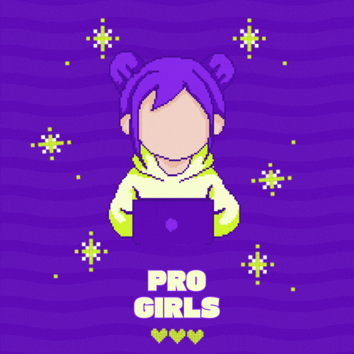

#### ✦ SEJA BEM-VINDA À PROGIRLS ✦

Aproveite essa jornada de aprendizado, conexão e crescimento.
**Juntas somos mais fortes.**

  
  
  
  
  
  

 

<table>
  <tr>
    <td width="50%" valign="top">

**✦ SOBRE A COMUNIDADE**

A **Programmer Girl (ProGirls)** é uma comunidade criada em 2023 com o objetivo de compartilhar conhecimento em programação e apoiar mulheres na tecnologia. Nosso foco é construir um ambiente seguro, colaborativo e inclusivo.

Hoje, somos um grupo de mulheres conectadas pelo aprendizado, pela troca de experiências e pelo crescimento coletivo.

Explore nossos [repositórios](https://github.com/orgs/Programmer-Girls/repositories), pratique os desafios e compartilhe seus aprendizados na comunidade:

- Contribua com código, ideias ou documentação
- Abra uma issue, faça um fork ou envie um PR
- Cresça junto com a comunidade

  </td>

  <td width="50%" valign="top" align="center">

</td>
</tr>
</table>

***

***

#### ✦ PROJETOS DA COMUNIDADE ✦

<!-- Adicionar novos projetos abaixo do site -->
<!-- Deixar o site sempre em primeiro lugar -->

| Projeto | Descrição | Duração | Status |
|--------|----------|--------|--------|
| **[Site Oficial](https://www.progirls.com.br/)** | Site institucional da ProGirls com informações sobre a comunidade, participação e conteúdos. | Contínuo |  |
| **Tech Week 2025** | Semana de palestras conectando a comunidade ao mercado de tecnologia. | 18 a 22 de Agosto de 2025 |  |
| **Roda de Conversa** | Encontros mensais para troca de experiências, soft skills e apoio na jornada tech. | Contínuo |  |
| **Núcleos de Estudos ProGirls** | Iniciativa colaborativa focada em estudo contínuo e apoio entre participantes. | Ciclo (em definição) |  |

***

#### ✦︎ REPOSITÓRIOS ✦

<!-- Adicionar novos projetos no topo -->

<table>

<tr>
<th>Projeto</th>
<th>Descrição</th>
<th>Status</th>
</tr>

<tr>
<td>
  <a href="https://github.com/Programmer-Girls/certificates-hub-progirls"><strong>certificates-hub-progirls</strong></a>
</td>
<td>
  Sistema de geração e envio automatizado de certificados com microsserviços e RabbitMQ.
</td>
<td>
  
</td>
</tr>

<tr>
<td>
  <a href="https://github.com/Programmer-Girls/api-despesas-python-03"><strong>api-despesas-python-03</strong></a>
</td>
<td>
  API RESTful em Python para controle de gastos com registro de transações e categorização financeira.
</td>
<td>
  
</td>
</tr>

<tr>
<td>
  <a href="https://github.com/Programmer-Girls/api-despesas-java-05"><strong>api-despesas-java-05</strong></a>
</td>
<td>
  API RESTful em Java (Spring Boot) para controle de despesas com JWT, OTP por e-mail, redefinição de senha e testes de integração.
</td>
</td>
<td>
  
</td>
</tr>

<tr>
<td>
  <a href="https://github.com/Programmer-Girls/api-despesas-python-02"><strong>api-despesas-python-02</strong></a>
</td>
<td>
  API de controle de despesas com Flask, Flask-Login e SQLAlchemy.
</td>
<td>
  
</td>
</tr>

</table>

***

**✦ CONHEÇA NOSSA EQUIPE ✦**

<!-- CRÉDITOS colocar em um doc separado-->

<!-- Este repositório foi desenvolvido com a colaboração de:

- **Natália** ([nataliatsi](https://github.com/nataliatsi)) — responsável pela estrutura, montagem e publicação do projeto  
- **Daniele** (https://github.com/damacosta) — criação do GIF da ProGirls  
- **Ana** (https://github.com/na-beatriz) — elaboração do texto sobre a comunidade -->

<!-- fazer: add link de pagina de voluntariado -->
